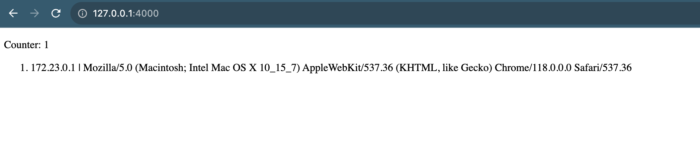

#ABB DevOps Assignment

### Application

API in Python, using:
* Flask (Python web framework)
* SQLAlchemy (ORM)
* Postgres (database)
* Docker (containerization)
* Docker Compose (to run the application and the database in containers)

#### Diagram


#### app.py 
The app.py file is the main file of the application: it contains all the endpoints and the logic of the application.

#### Run python unit test
First setup python venv on project folder
```shell
python -m venv abb
```
then we need to activate it

```shell
source abb/bin/activate
```

install requirements
```shell
pip install -r requirements.txt
```
Run unit test
```shell
python -m unittest -v
```

### Run Postgres Container
To run the Postgres container

```shell
docker compose up visitors_db
```

check if the container is running with
```shell
docker compose logs
```
Now, to test the db connection, use the following configuration:
- Host: localhost
- Port: 5432
- User: postgres
- Password: postgres
- Database: postgres

### Run  visitors_app service
Build app
```shell
docker compose build
```
then run 
```shell
docker compose up visitors_app
```
check at browser http://127.0.0.1:4000:



### Infrastructure


Initialize terraform
```shell
terraform init
terraform plan
```
then create infrastructure with
```shell
terraform apply
```
### Monitoring
On Amazon ECS, we can deploy the CloudWatch agent as a sidecar to your application container to collect metrics.
Or we can use Datadog agent as a sidecar too, both services bring as monitoring and observability over our application


### How to scale number of servers to take more load?
To scale horizontally without downtime our service we need to modify desired_count.
with terraform
```shell
terraform plan -var app_count=3 
terraform apply
```
or with aws_cli
```shell
$ aws --profile default ecs update-service --cluster abb-cluster --service visitors-service --desired-count 3
```
### Deployment architecture diagram

